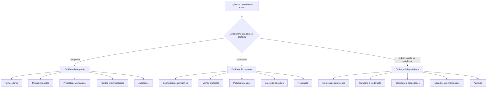

# Telas e navegação

O SIVI é uma **plataforma web B2B industrial multiempresa**. Ele intermedeia a relação comercial entre empresas compradoras e fornecedores/fabricantes aprovados; não vende nem fabrica os itens negociados.

> O inventário abaixo representa a visão funcional completa. A seleção de telas do MVP acadêmico ainda deve ser reduzida depois da validação industrial registrada em [15 — Alinhamento ao SENAI](15-alinhamento-senai-e-validacao-industrial.md).

Uma organização pode atuar como compradora, fornecedora ou nos dois papéis. Quando possuir os dois contextos, o usuário alterna a área ativa sem criar outra conta. Menus, consultas e ações dependem da organização, do contexto e das permissões do usuário autenticado.

## Superfícies do produto

O SIVI possui quatro superfícies deliberadamente separadas:

| Superfície | Conteúdo | Regra de acesso |
|---|---|---|
| Site institucional | Início, como funciona, compradores, fornecedores, confiança/rastreabilidade, FAQ, contato, termos e privacidade | Público; não expõe organizações, demandas ou propostas |
| Autenticação e onboarding | Entrar, recuperar acesso, aceitar convite, solicitar acesso e acompanhar aprovação | Público controlado ou tokenizado |
| Aplicação operacional | Jornadas de comprador, fornecedor e administração da plataforma | Sessão, organização ativa, contexto e autorização |
| Consulta de rastreabilidade | Resumo permitido de lote/entrega por token opaco | Público controlado, não indexável e revogável |

No MVP não existe marketplace público, demanda indexável, preço público ou checkout. Perfis industriais, oportunidades e propostas pertencem à aplicação autenticada e curada.

## Mapa de navegação do MVP

## Estrutura da aplicação

- autenticação centralizada para todos os participantes;
- vínculo do usuário a uma ou mais organizações por associação e papel;
- seletor de organização e de contexto quando houver mais de uma opção;
- marketplace curado: empresas entram por convite ou solicitação sujeita a aprovação;
- navegação responsiva em desktop, tablet e celular, sem instalação local;
- proteção das rotas e dos dados no servidor, mesmo quando uma opção não aparece no menu;
- alertas dentro da plataforma para decisões, prazos, revisões e mudanças de estado;
- atividades automáticas ligadas ao registro, ao responsável e ao prazo;
- busca e filtros sempre limitados ao que a organização autenticada pode consultar.

Embora estoque, produção, qualidade e logística possuam domínios próprios, a navegação não deve apresentá-los como quatro sistemas independentes. Eles aparecem como filas, abas e próximas ações dentro de **Pedidos** e **Execução**, preservando a continuidade da jornada.

## Inventário de telas do MVP

| Contexto | Tela | Objetivo principal |
|---|---|---|
| Público | Site institucional | Explicar o produto, sua confiança e solicitar acesso sem expor o marketplace autenticado |
| Público controlado | Consulta de rastreabilidade | Exibir somente os campos autorizados de um QR válido |
| Compartilhado | Login e recuperação | Autenticar com segurança e recuperar o acesso |
| Compartilhado | Convite, solicitação e aprovação | Entrar em uma organização ou acompanhar a validação B2B |
| Compartilhado | Seleção de contexto | Escolher organização e atuação como comprador, fornecedor ou administrador |
| Compartilhado | Minha conta | Manter dados pessoais, senha e sessões |
| Compartilhado | Notificações e atividades | Priorizar pendências e abrir o registro de origem |
| Empresa | Perfil da organização | Manter dados cadastrais, endereços, contatos e documentos de validação |
| Empresa | Usuários e permissões | Convidar membros e definir acessos dentro da organização |
| Comprador | Dashboard comprador | Resumir demandas, propostas, pedidos, prazos e qualidade |
| Comprador | Fornecedores | Pesquisar fornecedores aprovados por categoria, marca/fabricante atendido, capacidade, material, localização e reputação |
| Comprador | Perfil do fornecedor | Exibir atuação como fabricante, distribuidor ou revendedor, marcas atendidas, capacidades declaradas, certificações, região, indicadores e avaliações de pedidos entregues |
| Comprador | Minhas demandas | Listar, filtrar, criar e acompanhar demandas da organização |
| Comprador | Nova demanda | Informar especificação, quantidade, unidade, prazo, destino, anexos e critérios técnicos |
| Comprador | Detalhe da demanda | Reunir versões, fornecedores compatíveis, propostas, eventos e decisões |
| Comprador | Matches explicados | Mostrar fornecedores elegíveis e os motivos objetivos de compatibilidade |
| Comprador | Propostas recebidas | Consultar propostas válidas sem expor dados a fornecedores concorrentes |
| Comprador | Comparador de propostas | Comparar fornecedor, marca/fabricante, custo total, prazo, aderência técnica, garantia, reputação e suas dimensões históricas de qualidade |
| Comprador | Revisão de proposta | Solicitar nova versão e preservar o histórico da negociação |
| Comprador | Aceite e pedido | Confirmar a versão escolhida e gerar o pedido correspondente |
| Comprador | Acompanhamento | Consultar operação, lotes, qualidade, QR Code, envio, ocorrências e entrega |
| Comprador | Avaliação | Avaliar o fornecedor após uma entrega confirmada |
| Fornecedor | Dashboard fornecedor | Resumir oportunidades, propostas, conversão, pedidos, prazos e reputação |
| Fornecedor | Oportunidades | Exibir demandas compatíveis liberadas para a organização |
| Fornecedor | Detalhe da oportunidade | Consultar especificação, prazo, destino, anexos e dúvidas/revisões registradas |
| Fornecedor | Editor de proposta | Informar marca/fabricante do item, preço, frete, prazo, pagamento, validade, garantia estruturada e observações técnicas |
| Fornecedor | Histórico de propostas | Consultar versões enviadas, pedidos de revisão e resultados |
| Fornecedor | Pedidos recebidos | Listar os pedidos originados de propostas aceitas |
| Fornecedor | Execução do pedido | Declarar atendimento por estoque, produção ou modelo misto e atualizar marcos |
| Fornecedor | Lotes e qualidade | Registrar lotes, inspeções, quantidades aprovadas/rejeitadas e não conformidades |
| Fornecedor | QR Code | Gerar e consultar o identificador rastreável de cada lote liberado |
| Fornecedor | Entrega | Informar preparação, expedição, transporte e entrega de forma manual |
| Fornecedor | Reputação | Consultar notas verificadas e indicadores próprios |
| Administração da plataforma | Empresas e aprovações | Validar, aprovar, suspender e reativar organizações |
| Administração da plataforma | Curadoria | Moderar categorias, capacidades, denúncias e conteúdo do marketplace |
| Administração da plataforma | Indicadores | Acompanhar cobertura, conversão, prazos e saúde operacional da plataforma |
| Administração da plataforma | Auditoria | Consultar eventos críticos sem alterar o histórico |

Em um registro operacional, a linha do tempo deve distinguir evento automático, mensagem compartilhada, nota interna, atividade e auditoria. Eles podem aparecer próximos visualmente, mas não compartilham a mesma visibilidade ou finalidade.

## Dashboards modernos por contexto

### Empresa compradora

- demandas em rascunho, publicadas e aguardando decisão;
- quantidade de fornecedores compatíveis por demanda;
- propostas recebidas, próximas do vencimento e aguardando revisão;
- faixa de custo total entre propostas válidas;
- pedidos por etapa e pedidos atrasados;
- entregas aguardando confirmação;
- fornecedores mais contratados pela própria organização e qualidade média recebida;
- tempo médio até a primeira proposta e até o aceite.

### Empresa fornecedora

- novas oportunidades compatíveis e prazos para responder;
- propostas enviadas, em revisão, aceitas, recusadas e vencidas;
- taxa de conversão de propostas;
- valor dos pedidos aceitos e entregues pela própria organização;
- pedidos atendidos por estoque, produção ou modelo misto;
- lotes aguardando inspeção e não conformidades;
- entregas próximas do prazo ou atrasadas;
- nota média, avaliações recebidas e percentual de entregas no prazo.

### Administração da plataforma

- empresas aguardando aprovação e empresas ativas por atuação;
- demandas abertas e cobertura de fornecedores compatíveis;
- taxa de demandas com proposta e taxa de conversão em pedido;
- tempo até o primeiro match, primeira proposta, aceite e entrega;
- valor negociado por meio da plataforma, sem tratá-lo como faturamento do SIVI;
- ocorrências, denúncias, suspensões e pontos de abandono do fluxo;
- categorias, regiões e capacidades com baixa cobertura.

## Telas centrais da demonstração

### Detalhe da demanda

Deve reunir a especificação solicitada, anexos, prazos, histórico de versões, fornecedores compatíveis, propostas recebidas e eventos. O comprador visualiza todas as propostas destinadas à própria demanda; cada fornecedor visualiza somente sua participação.

### Comparador de propostas

É a principal tela de decisão comercial. Cada proposta deve ser comparada na mesma base:

- custo dos itens, frete e custo total;
- organização fornecedora, sua atuação na oferta, marca e fabricante real, quando aplicáveis;
- prazo de fabricação/preparação e prazo de entrega;
- aderência integral ou ressalvas à especificação;
- material, acabamento, condições de pagamento e garantia com responsável, prazo, cobertura e exclusões essenciais;
- certificações e capacidade relevantes com origem, situação e data da informação;
- qualidade histórica como dimensão da reputação, sem contagem duplicada;
- nota, quantidade de avaliações de pedidos entregues, pedidos concluídos, entregas no prazo e período analisado;
- validade e versão da proposta.

O comparador permite ordenar e filtrar, mas não escolhe automaticamente o vencedor. A decisão permanece com a empresa compradora.

A qualidade mostrada nessa etapa é histórica e vem de transações anteriores registradas. “Avaliação de pedido entregue” confirma a origem da avaliação, não uma auditoria independente do SIVI. A inspeção dos lotes do pedido atual só existe depois da contratação e aparece na rastreabilidade operacional.

### Pedido e rastreabilidade

Deve apresentar uma linha do tempo única que conecte:

1. demanda publicada;
2. proposta escolhida e versão aceita;
3. atendimento por estoque, produção ou modelo misto;
4. lotes e inspeções de qualidade;
5. liberação e QR Code;
6. expedição e transporte;
7. confirmação de entrega;
8. avaliação de pedido entregue.

## Estados de interface necessários

Toda tela com dados ou decisão deve considerar:

- carregamento e atualização;
- estado vazio com orientação objetiva;
- erro recuperável sem perder dados preenchidos;
- falta de permissão ou de contexto;
- confirmação de ação irreversível;
- sucesso com identificação do registro criado;
- validação antes e depois do envio;
- conflito de edição e dado desatualizado;
- prazo vencido;
- empresa em análise, suspensa ou sem aprovação;
- “sem histórico” para fornecedor novo, sem atribuir nota zero;
- conteúdo sensível indisponível por isolamento entre organizações.

## Regras de navegação e isolamento

- o identificador da organização ativa deve ser validado no servidor em toda operação;
- trocar um identificador na URL não pode revelar dados de outra empresa;
- fornecedores concorrentes não visualizam propostas, preços ou documentos uns dos outros;
- a administração do SIVI acessa apenas o necessário para curadoria, suporte e auditoria;
- alternar entre comprador e fornecedor muda o contexto, não a titularidade dos dados;
- ações críticas registram organização, usuário, contexto, data e origem.
- a consulta por QR utiliza uma projeção de campos permitidos e nunca consulta o lote privado diretamente pelo token recebido.
