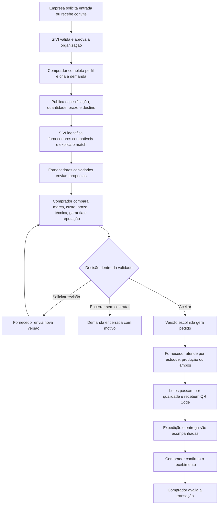

# Experiência da empresa compradora — MVP

> O nome do arquivo foi preservado para não quebrar links antigos. Este documento **não está adiado**: a experiência compradora é parte central do MVP do SIVI.

## Objetivo

A área compradora permite que uma empresa publique uma necessidade industrial, encontre fornecedores/fabricantes aprovados, compare propostas em critérios equivalentes, contrate a melhor alternativa e acompanhe a execução até a avaliação.

O SIVI não é uma loja pública com checkout imediato. É um marketplace B2B curado para produtos industriais e soluções sob medida, em que preço, prazo, capacidade, especificação, qualidade e logística precisam ser negociados.

## Quem é a empresa compradora

Uma organização aprovada pode:

- atuar somente como compradora;
- atuar como compradora e fornecedora;
- possuir mais de um usuário, com permissões internas;
- alternar para o contexto fornecedor sem criar outra empresa quando tiver as duas atuações.

O comprador escolhe o fornecedor; o SIVI apresenta informações, regras de match e comparação, mas não toma a decisão comercial.

## Jornada principal

## Conta, empresa e equipe

- solicitar entrada ou ativar convite;
- entrar, sair e recuperar o acesso;
- consultar o estado de aprovação da organização;
- manter dados cadastrais, endereços, contatos e documentos permitidos;
- solicitar correção de razão social ou CPF/CNPJ sem alterar campos críticos diretamente;
- convidar membros da própria empresa;
- atribuir papéis de administrador da organização, comprador e consulta;
- consultar aviso de privacidade, termos e canal de suporte;
- alternar organização e contexto quando autorizado.

Mudanças de documento, atuação ou dado cadastral crítico podem exigir nova validação pelo SIVI.

## Dashboard comprador

O dashboard deve responder rapidamente:

- quais demandas precisam ser publicadas ou decididas;
- quantos fornecedores compatíveis foram encontrados;
- quais demandas receberam poucas ou nenhuma proposta;
- quais propostas estão próximas do vencimento;
- qual é a faixa de custo total entre propostas comparáveis;
- quais pedidos estão em preparação, produção, qualidade ou transporte;
- quais prazos estão em risco ou atrasados;
- quais entregas aguardam confirmação;
- quais pedidos podem ser avaliados;
- qual o histórico de qualidade e pontualidade dos fornecedores contratados.

Cada indicador mostra período, filtro e origem. Valores negociados entre empresas não são faturamento do SIVI.

## Marketplace de fornecedores

O comprador pode:

- pesquisar fornecedores aprovados;
- filtrar por categoria, marca ou fabricante atendido, material, processo, capacidade, certificação, região atendida e reputação;
- abrir o perfil industrial da empresa;
- consultar se a empresa atua como fabricante, distribuidora ou revendedora, as marcas atendidas, capacidades declaradas, certificações validadas, localização/região, avaliações de pedidos entregues e entregas no prazo;
- distinguir fornecedor sem histórico de fornecedor mal avaliado;
- convidar fornecedor compatível para uma demanda própria.

O marketplace não expõe:

- propostas ou preços enviados para outras empresas;
- empresas compradoras atendidas sem autorização;
- dados pessoais de contatos;
- capacidade ou documento marcado como privado;
- informações operacionais de pedidos de terceiros.

## Publicação da demanda

A empresa compradora informa:

- título e categoria;
- descrição do produto ou solução;
- quantidade e unidade;
- material, dimensões, tolerâncias, acabamento, resistência e embalagem, quando aplicáveis;
- processo ou capacidade exigida;
- certificações obrigatórias;
- prazo desejado e prazo limite para propostas;
- local de entrega e região;
- condições ou restrições comerciais;
- marca preferida e aceitação de equivalente, quando isso fizer sentido para a categoria;
- desenhos, imagens, especificações e outros anexos permitidos.

O formulário deve adaptar campos à categoria sem impedir uma descrição livre. Antes de publicar, o sistema mostra um resumo do que ficará visível aos fornecedores convidados.

Mudança relevante após a publicação cria uma nova versão da demanda e registra o motivo. Fornecedores participantes recebem aviso e podem revisar a própria proposta.

## Match explicado

O resultado do match apresenta:

- critérios atendidos;
- critérios parcialmente atendidos;
- requisitos obrigatórios ausentes;
- dados ainda não confirmados;
- origem das informações usadas;
- data da última atualização do perfil do fornecedor.

O match do MVP usa regras, não IA preditiva. Estar compatível não garante contratação ou capacidade final; o fornecedor confirma condições na proposta.

## Propostas e comparação

### Conteúdo da proposta

- quantidade atendida;
- preço unitário ou global;
- frete e custo total;
- prazo de preparação/fabricação;
- previsão de entrega;
- material, processo, acabamento e demais respostas técnicas;
- marca, fabricante real, código do fabricante e atuação da empresa fornecedora, quando aplicáveis;
- ressalvas à especificação;
- forma e condição de pagamento;
- responsável, início, duração, cobertura e exclusões essenciais da garantia;
- validade;
- versão, autor e data de envio.

### Comparador

O comprador visualiza propostas válidas lado a lado e pode:

- ordenar por custo total, prazo ou reputação;
- filtrar propostas que atendem integralmente aos critérios;
- distinguir organização fornecedora, marca e fabricante do item;
- destacar diferenças técnicas e ressalvas;
- consultar qualidade histórica dentro da reputação, nota, quantidade de avaliações de pedidos entregues, pedidos concluídos, percentual de entregas no prazo e período;
- comparar responsável, duração, cobertura e exclusões essenciais da garantia;
- solicitar revisão com motivo;
- recusar ou encerrar uma proposta;
- selecionar a versão que melhor atende à empresa.

O sistema não declara automaticamente uma proposta como “melhor”. Menor preço pode perder para marca/fabricante, prazo, qualidade, aderência, garantia, reputação ou condição comercial. Visualizações e curtidas não contam como reputação; indicadores de atuação usam apenas eventos verificáveis da plataforma e exibem período e amostra.

Nesse momento, “qualidade” significa histórico verificado do fornecedor. A inspeção do pedido atual só começa após o aceite e é apresentada nos lotes da rastreabilidade.

### Aceite

Ao aceitar:

1. o sistema confirma que a versão está válida e ainda pode ser escolhida;
2. exibe fornecedor, marca/fabricante quando aplicáveis, especificação, quantidade, custo total, prazo, pagamento e resumo da garantia;
3. registra organização, usuário, data e versão;
4. gera um único pedido, mesmo se a ação for repetida;
5. marca as demais propostas como não selecionadas;
6. preserva todo o histórico da demanda.

No MVP, uma demanda escolhe um fornecedor. Contratação dividida fica para evolução.

## Pedido e acompanhamento

O comprador pode consultar:

- demanda e proposta que originaram o pedido;
- fornecedor responsável;
- valores e condições congeladas;
- atendimento declarado por estoque, produção ou modelo misto;
- resumo compartilhado das quantidades comprometidas e planejadas, sem expor o estoque privado completo;
- previsão vigente e mudanças justificadas;
- lotes vinculados;
- inspeções, aprovações, rejeições e não conformidades visíveis;
- QR Code dos lotes liberados;
- preparação, expedição, transporte e entrega;
- ocorrências e histórico cronológico.

O acompanhamento não dá ao comprador controle sobre a fábrica do fornecedor. Ele mostra os marcos acordados e as evidências compartilhadas.

## Qualidade e QR Code

Para cada lote liberado, o comprador pode:

- consultar código, quantidade, data e fornecedor;
- verificar resultado e situação da inspeção;
- identificar a versão do plano de inspeção aplicada e os controles obrigatórios;
- ver documentos ou evidências liberados;
- identificar não conformidades e respectivas resoluções;
- abrir a rastreabilidade pelo QR Code;
- confirmar que o lote pertence ao pedido esperado.

O QR Code usa identificador seguro. Ele não grava preço, contatos pessoais ou dados confidenciais diretamente na imagem.

## Entrega, ocorrência e confirmação

- fornecedor registra expedição, modalidade, transportadora quando houver e previsão;
- comprador acompanha atualizações manuais;
- atraso é destacado com base na previsão vigente;
- comprador registra avaria, quantidade divergente, atraso ou outro problema;
- comprador confirma o recebimento;
- uma exceção encerrada pela administração mantém justificativa e auditoria.

O MVP não possui GPS nem integração automática com transportadora.

## Avaliação de pedido entregue

Após a entrega confirmada, o comprador avalia de 1 a 5:

- qualidade;
- cumprimento do prazo;
- conformidade com a especificação;
- atendimento;
- custo-benefício.

Há uma avaliação por pedido entregue. O rótulo “avaliação de pedido entregue” informa que a transação ocorreu na plataforma, não que o SIVI auditou tecnicamente o produto. A reputação mostra nota ponderada, quantidade de avaliações, pedidos concluídos, entregas no prazo e período. Comentários podem ser moderados, mas decisões administrativas preservam histórico.

## Estados mostrados ao comprador

### Demanda

| Estado | Significado |
|---|---|
| Rascunho | Ainda não está visível a fornecedores |
| Publicada | Está disponível aos fornecedores elegíveis convidados |
| Recebendo propostas | Há negociação ativa dentro do prazo |
| Em decisão | Prazo de propostas encerrado ou comprador iniciou comparação |
| Contratada | Uma proposta foi aceita e gerou pedido |
| Concluída | Pedido entregue e fluxo encerrado |
| Expirada | Terminou sem contratação |
| Cancelada | Foi encerrada com motivo |

### Pedido

| Estado | Significado |
|---|---|
| Confirmado | Proposta aceita e pedido criado |
| Em preparação | Fornecedor está separando ou planejando o atendimento |
| Em produção | Há quantidade em fabricação |
| Em qualidade | Lotes estão em inspeção ou correção |
| Pronto para envio | Quantidade da remessa foi liberada |
| Em transporte | Pedido foi expedido |
| Entregue | Recebimento foi confirmado |
| Ocorrência | Existe exceção registrada em uma etapa |
| Cancelado | Pedido foi encerrado pelo fluxo autorizado |

## Telas da experiência compradora

| Tela | Conteúdo essencial |
|---|---|
| Entrada, ativação e login | Solicitação/convite, senha, acesso e recuperação |
| Seleção de contexto | Organização e atuação ativa |
| Dashboard | Demandas, propostas, pedidos, prazos, qualidade e alertas |
| Marketplace | Busca e filtros de fornecedores aprovados |
| Perfil do fornecedor | Capacidades, certificações, regiões e reputação |
| Minhas demandas | Lista, filtros, estado e ação pendente |
| Nova demanda | Especificação, quantidade, prazo, destino e anexos |
| Detalhe da demanda | Versões, match, convidados, propostas e eventos |
| Comparador | Critérios normalizados, diferenças e seleção |
| Revisão | Pedido de ajuste e histórico de versões |
| Aceite | Confirmação da versão e geração do pedido |
| Meus pedidos | Lista e filtros por estado, fornecedor e prazo |
| Rastreabilidade | Operação, lotes, qualidade, QR, entrega e ocorrência |
| Avaliação | Notas e comentário após entrega |
| Minha empresa | Cadastro, membros, permissões, documentos e privacidade |

## Permissões e isolamento

- toda consulta e alteração é filtrada pela organização ativa no servidor;
- usuário comprador só vê demandas, propostas, pedidos e avaliações autorizados para sua empresa;
- fornecedor concorrente não vê quem participou nem quais condições foram oferecidas;
- administrador da empresa gerencia seus membros, não usuários de outras organizações;
- usuário com contexto fornecedor não reutiliza esse contexto para acessar propostas de concorrentes;
- aceite, revisão, cancelamento, ocorrência, entrega e avaliação guardam autor e data;
- suporte administrativo é auditado e limitado ao necessário.

## Ativação e segurança

1. A organização solicita acesso ou recebe convite.
2. O SIVI valida os dados necessários e aprova, rejeita ou pede correção.
3. O contato responsável recebe link único com validade.
4. O usuário confirma o e-mail, cria senha e entra na organização.
5. O administrador da organização pode convidar membros conforme sua permissão.

Também são necessários limite de tentativas, sessões seguras, HTTPS, mensagens de recuperação que não confirmem a existência do e-mail, registro de eventos críticos e encerramento de sessões após redefinição de senha. MFA pode entrar depois.

## Privacidade e dados pessoais

- coletar somente dados necessários a acesso, verificação, negociação, entrega e suporte;
- explicar finalidade e compartilhamento em aviso de privacidade;
- separar dados públicos do perfil, dados compartilhados na negociação e dados internos;
- não expor contatos pessoais a empresas sem relação autorizada;
- proteger anexos por autorização, não apenas por URL;
- definir retenção, correção e exclusão/anonimização conforme obrigação aplicável;
- usar dados fictícios ou autorizados na demonstração acadêmica.

## Fora da experiência compradora inicial

- cadastro e publicação anônimos;
- checkout e compra imediata;
- pagamento online, split ou escrow;
- assinatura eletrônica de contrato;
- chat em tempo real;
- contratação de vários vencedores na mesma demanda;
- rastreamento GPS;
- integração fiscal;
- integração automática com ERP ou transportadora;
- decisão automática pelo “melhor fornecedor”;
- previsão de demanda e recomendações por IA.

## Critérios de aceite

- empresa compradora publica uma demanda completa sem acessar dados de outra organização;
- match mostra fornecedores elegíveis e explica cada resultado;
- fornecedor não convidado não abre a demanda por manipulação de URL;
- propostas concorrentes permanecem privadas;
- mudança relevante na demanda ou proposta cria versão;
- comparador apresenta os critérios na mesma base e destaca ressalvas;
- proposta vencida, retirada ou substituída não pode ser aceita;
- aceite repetido gera um único pedido e registra a versão exata;
- comprador acompanha estoque/produção declarados, lotes, qualidade, QR Code e entrega;
- lote reprovado não aparece como liberado;
- confirmação de entrega habilita uma única avaliação vinculada ao pedido entregue;
- fornecedor novo aparece como “sem histórico”, não como nota zero;
- login, formulários, comparador e linha do tempo funcionam por teclado e possuem rótulos claros.

## Fontes de referência

- Os [princípios da LGPD](https://www.gov.br/saude/pt-br/acesso-a-informacao/lgpd/principios) orientam finalidade, necessidade, transparência, qualidade e segurança no uso dos dados.
- O [guia de autenticação da OWASP](https://cheatsheetseries.owasp.org/cheatsheets/Authentication_Cheat_Sheet.html) orienta mensagens genéricas, recuperação e proteção do acesso.
- As [WCAG 2.2](https://www.w3.org/WAI/standards-guidelines/wcag/new-in-22/) e o [tutorial de formulários do W3C](https://www.w3.org/WAI/tutorials/forms/) orientam rótulos, instruções, foco e feedback acessível.
