# Documentação do SIVI

## Estado atual

**Evolução funcional — 27/09/2026:** [32 — Evolução e continuidade](32-evolucao-e-continuidade.md): reutilizar demandas, filtros e ordenação, CSV, impressão, avisos de datas, publicação consistente e encerramento de oportunidades. Landing com fluxo interativo e referências profissionais. [33 — Transferência e limpeza](33-transferencia-e-limpeza.md) orienta a mudança de local e classifica os arquivos dispensáveis.

**Minimalismo industrial — 27/09/2026:** [31 — Refinamento visual](31-minimalismo-industrial.md): painéis, navegação, formulários, empresas e jornada com menos molduras e decoração. 133 unitários e 112 testes de navegador/emuladores aprovados; 180 verificações de largura sem transbordamento da página.

**Revisão final — 27/09/2026:** [30 — Revisão final do produto](30-revisao-final-do-produto.md): quantidades e inspeção por item, validade em São Paulo, propostas identificadas por demanda, proteção de navegação, perfil industrial e administração, página pública simplificada. Resultados finais, evidências e limites no documento.

**Revisão integrada — 26/09/2026:** [29 — Revisão para uso manual](29-revisao-integrada.md): recuperação da nova demanda, busca, feedback, atualização de registros, navegação por teclado e distinção entre gravação confirmada e falha de atualização. 111 testes unitários e 98 de navegador/emuladores aprovados; roteiro de revisão e limites explícitos.

**Próximas entregas — 26/09/2026:** [28 — Próximos passos](28-proximos-passos.md): recorte 1A aplicado e verificado localmente; condições comerciais de pedidos existentes e transições da demanda protegidas. Próxima entrega: concorrência e repetição segura, antes de continuidade de uso, negociação por item e rastreabilidade. Novas regras ainda não publicadas no Firebase remoto.

**Conforto de uso — 26/09/2026:** [27 — Conforto e acessibilidade](27-conforto-e-acessibilidade.md): preferências de leitura, tema e movimento; continuidade dos filtros; formulário de demandas e pesquisa de design.

**Retomada — 20/09/2026:** [25 — Transferência e retomada](25-transferencia-e-retomada.md): requisitos, pacote portátil, validação e repositório `kauanoIiveira/sivi`. A página pública e seu rodapé foram revisados e aprovados; manter essa base para as próximas telas.

**Entrada de empresas — 18/09/2026:** [24 — Entrada e aprovação](24-entrada-e-aprovacao.md): página pública, cadastro guiado, análise, correção/reenvio e primeiro acesso.

**Direção de 16/09/2026:** sistema em funcionamento, com UI industrial revisada antes das próximas páginas. Consulte [22 — Limpeza e revisão da UI](22-limpeza-e-revisao-ui.md) e [Design System](../design-system/MASTER.md). Os planos e registros da demo removida permanecem recuperáveis no histórico Git.

**Atualização de 18/09/2026:** [23 — Jornada e portal administrativo](23-jornada-e-proximas-acoes.md): próximas ações, registros conectados e cadastro de empresas pelo administrador. Regras publicadas no Firebase.

**Fase:** base funcional conectada ao Firebase com as fases 1 e 2 do MVP acadêmico dinâmico implementadas. Usuários cadastram empresas compradoras, fornecedoras ou de dupla atuação; a administração aprova ou bloqueia; fornecedores mantêm perfis industriais; compradores publicam demandas com vários itens; e o sistema gera matches explicáveis. Operação industrial por lote, QR e preparação da apresentação continuam nas próximas fases. O plano vigente está em [19 — Plano do MVP acadêmico dinâmico](19-plano-mvp-academico-dinamico.md).

**Produto:** plataforma web B2B industrial, multiempresa e responsiva. O SIVI atua como intermediador entre empresas compradoras e fornecedores/fabricantes; não fabrica, compra ou vende os produtos negociados.

**Frase de posicionamento:** Da demanda industrial à entrega rastreável.

## Definição rápida

Uma empresa compradora publica uma necessidade industrial. O SIVI identifica fornecedores compatíveis por regras explicáveis. Os fornecedores enviam propostas e o comprador compara fornecedor, marca/fabricante quando aplicáveis, custo total, prazo, aderência técnica, garantia, certificações, reputação com amostra, pedidos concluídos, pontualidade e condições. Depois do aceite, a proposta vira pedido e o fornecedor registra atendimento por estoque ou produção, inspeção do lote atual, QR Code, expedição e entrega. O comprador acompanha o processo e avalia o resultado.

O marketplace é autenticado e curado: apenas organizações e usuários aprovados participam. Uma organização poderá atuar como compradora, fornecedora ou em ambos os papéis, sempre com isolamento de dados.

## Mapa da documentação

| Documento | Conteúdo |
|---|---|
| [01 — Visão do produto](01-visao-do-produto.md) | Problema, proposta de valor, posicionamento e limites |
| [02 — Escopo e MVP](02-escopo-e-mvp.md) | Fatia vertical, simplificações e evolução escalável |
| [03 — Atores e permissões](03-atores-e-permissoes.md) | Organizações, perfis e isolamento multiempresa |
| [04 — Requisitos](04-requisitos.md) | Requisitos funcionais e não funcionais priorizados |
| [05 — Fluxos e estados](05-fluxos-e-estados.md) | Jornada ponta a ponta e ciclos de vida separados |
| [06 — Modelo de dados](06-modelo-de-dados.md) | Entidades e relacionamentos multiempresa |
| [07 — Telas e navegação](07-telas-e-navegacao.md) | Experiências de comprador, fornecedor e administração |
| [08 — Regras de negócio](08-regras-de-negocio.md) | Match, propostas, pedido, operação, qualidade e avaliação |
| [09 — Roadmap](09-roadmap.md) | Ordem de implementação por fatias demonstráveis |
| [10 — Decisões do produto](10-decisoes-em-aberto.md) | Decisões aprovadas, pontos reabertos e escolhas ainda pendentes |
| [11 — Experiência da empresa compradora](11-portal-do-cliente.md) | Marketplace, comparação, acompanhamento e avaliação |
| [12 — Design e experiência](12-design-e-experiencia.md) | Direção conceitual para marketplace e operação; não aprovada |
| [13 — Continuidade](13-continuacao-em-outro-computador.md) | Estado e instruções para retomada |
| [14 — Benchmark funcional da Odoo](14-arquitetura-escalavel.md) | Features adotadas, adaptadas ou rejeitadas e sua ordem funcional de produção |
| [15 — Alinhamento ao SENAI](15-alinhamento-senai-e-validacao-industrial.md) | Auditoria industrial, lacunas acadêmicas, recorte executável e ordem de validação |
| [16 — Implementação do acesso](16-implementacao-do-acesso.md) | Cadastro, login, movimento, Firebase, testes e pendências de configuração |
| [19 — Plano do MVP acadêmico dinâmico](19-plano-mvp-academico-dinamico.md) | Limites, cenário obrigatório, ordem de execução e critérios de conclusão acadêmica |
| [20 — Plano de implementação do MVP dinâmico](20-plano-de-implementacao-mvp-dinamico.md) | Fases técnicas, arquivos, regras, testes, commits e critérios de aceite |
| [21 — Entrega Firebase, empresas, perfil e match](21-entrega-firebase-empresas-perfil-match.md) | O que foi implementado nas fases 1 e 2 e como habilitar a administração |
| [22 — Limpeza e revisão da UI](22-limpeza-e-revisao-ui.md) | Organização e direção industrial |
| [23 — Jornada e próximas ações](23-jornada-e-proximas-acoes.md) | Navegação operacional e portal administrativo |
| [24 — Entrada e aprovação](24-entrada-e-aprovacao.md) | Cadastro público, revisão administrativa e página pública |
| [25 — Transferência e retomada](25-transferencia-e-retomada.md) | Ambiente, pacote portátil e futuro repositório |
| [26 — Revisão e evolução](26-revisao-e-evolucao.md) | Edição de rascunhos, correções e prioridades de implementação |
| [27 — Conforto e acessibilidade](27-conforto-e-acessibilidade.md) | Preferências de leitura, temas e movimento |
| [28 — Próximos passos](28-proximos-passos.md) | Consistência comercial e sequência de evolução |
| [29 — Revisão integrada](29-revisao-integrada.md) | Melhorias aplicadas, evidências e roteiro para revisão manual |
| [30 — Revisão final do produto](30-revisao-final-do-produto.md) | Unidades, inspeção por item, confiabilidade de formulários e refinamento visual |
| [31 — Minimalismo industrial](31-minimalismo-industrial.md) | Superfícies planas, divisórias, hierarquia tipográfica e validação visual |

## Fluxo principal

O diagrama abaixo descreve o fluxo de produto planejado. Estoque/produção, lotes e QR continuam pendentes; a operação implementada usa inspeção por pedido. Consulte `CONTINUE_AQUI.md` para separar entregas atuais de próximas etapas.

```mermaid
flowchart LR
    COMPRADOR["Empresa compradora"] --> DEMANDA["Publica demanda"]
    DEMANDA --> MATCH["Match explicável"]
    MATCH --> PROPOSTAS["Fornecedores enviam propostas"]
    PROPOSTAS --> COMPARA["Comprador compara e negocia"]
    COMPARA --> ACEITE["Aceite da proposta"]
    ACEITE --> PEDIDO["Pedido rastreável"]
    PEDIDO --> ATENDIMENTO{"Estoque suficiente?"}
    ATENDIMENTO -- "Sim" --> QUALIDADE["Lote e qualidade"]
    ATENDIMENTO -- "Não" --> PRODUCAO["Produção da quantidade faltante"]
    PRODUCAO --> QUALIDADE
    QUALIDADE --> QR["QR Code seguro"]
    QR --> ENTREGA["Expedição e entrega"]
    ENTREGA --> AVALIACAO["Avaliação e indicadores"]
```

## Recorte acadêmico

O diferencial para o SENAI está na integração de:

- marketplace B2B industrial;
- configuração de demandas e capacidade produtiva;
- comparação comercial e reputação;
- estoque e produção do fornecedor;
- controle de qualidade, lotes e retrabalho;
- QR Code e rastreabilidade;
- logística por eventos;
- dashboards modernos e indicadores explicáveis;
- segurança, auditoria e arquitetura multiempresa.

O sistema aceita cadastros e registros dinâmicos. Os testes usam dados controlados em emuladores. Pagamentos, fiscal, assinatura jurídica, integrações logísticas e inteligência preditiva avançada ficam fora da primeira versão.

## Escalabilidade adotada

- organização como unidade de isolamento dos dados;
- organização capaz de comprar, fornecer ou exercer ambos os papéis;
- propostas e negociações versionadas;
- capacidades e critérios de match configuráveis;
- eventos de domínio e histórico de estados;
- arquivos técnicos protegidos;
- QR Code baseado em identificador seguro;
- motor de regras separado para evoluir posteriormente;
- possibilidade futura de fabricantes publicarem demandas de insumos no mesmo marketplace.

## Direção de implementação

- sistema exclusivamente web;
- HTML, CSS e JavaScript puro (vanilla), sem framework de interface nesta fase;
- Live Server como servidor local e Anime.js na transição de acesso;
- Firebase Authentication e Realtime Database escolhidos provisoriamente para a fase inicial;
- Python pode complementar funções específicas, mas não está aprovado como camada obrigatória;
- regras multiempresa, armazenamento de anexos e hospedagem ainda precisam ser validados;
- nenhum framework de backend adicional ou arquitetura distribuída foi aprovado.

As features e os fluxos devem orientar a escolha técnica, não o contrário. As próximas telas devem seguir o Design System vigente e os fluxos de negócio documentados.

Modelar uma extensão não significa implementá-la no MVP.

## Convenções

- `RF-*`: requisito funcional.
- `RNF-*`: requisito não funcional.
- `RN-*`: regra de negócio.
- `DEC-*`: decisão aprovada do produto.
- **MVP**: menor versão que demonstra a jornada completa e o diferencial.
- **Modelar agora**: preservar a possibilidade na arquitetura sem entregar a interface completa.
- **Futuro**: evolução válida que não bloqueia o MVP.

Em caso de conflito entre documentos, prevalecem as decisões mais recentes de [`10 — Decisões do produto`](10-decisoes-em-aberto.md).
